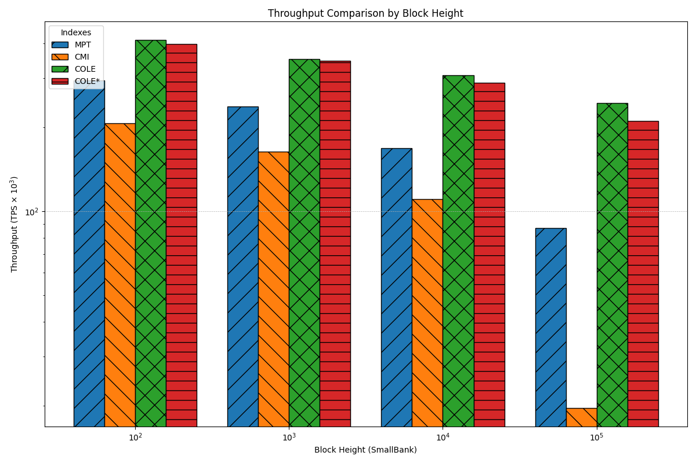
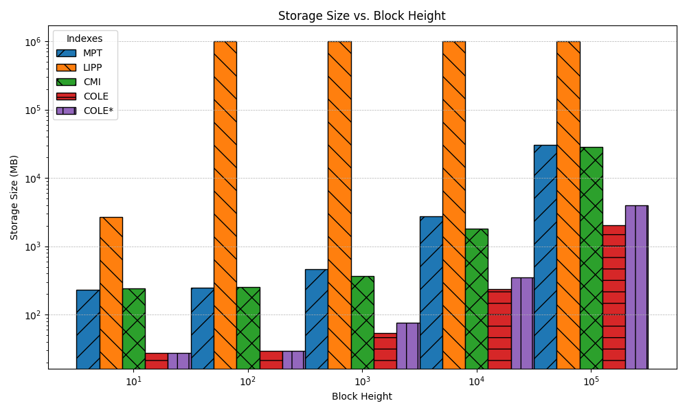
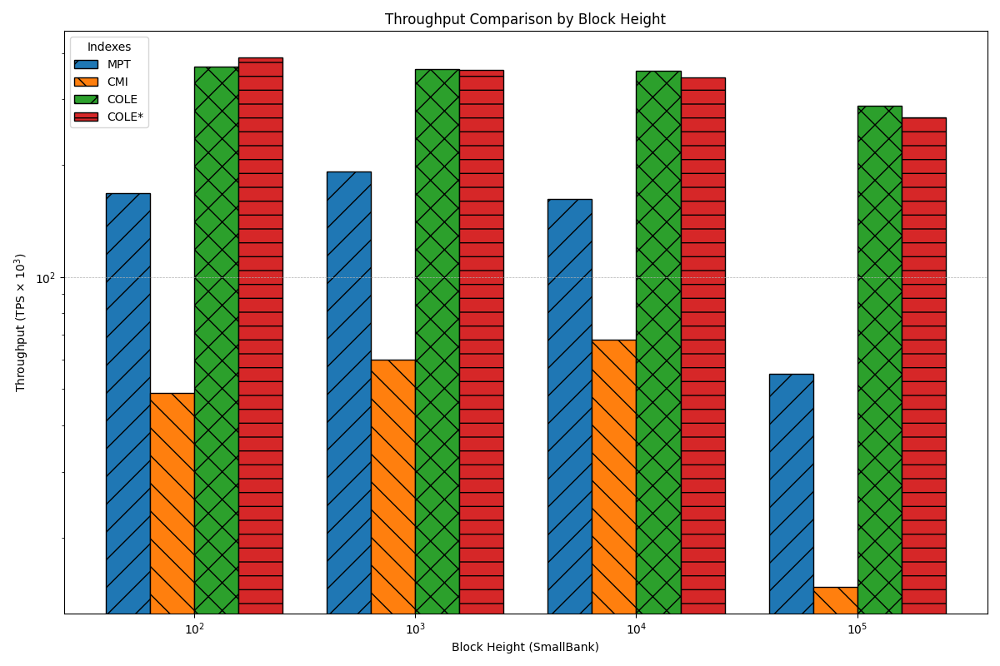
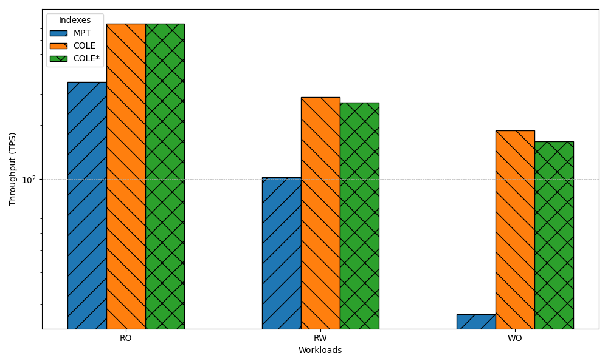
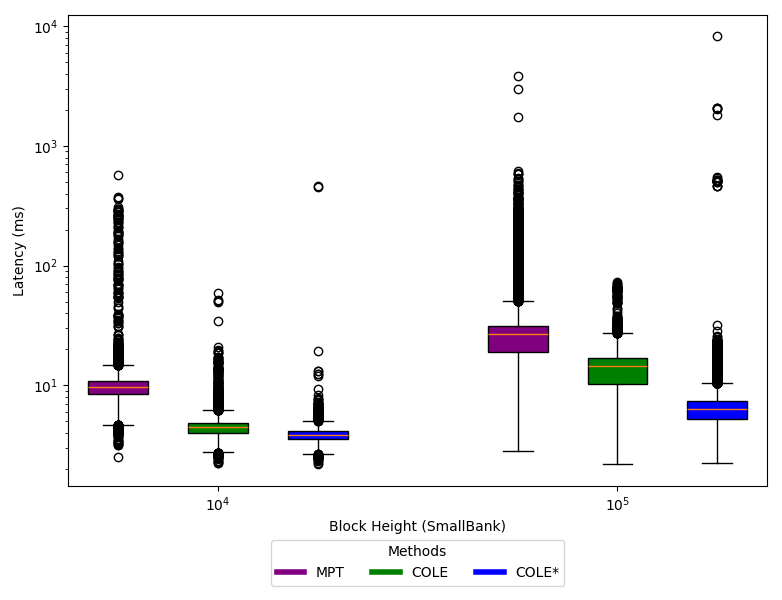
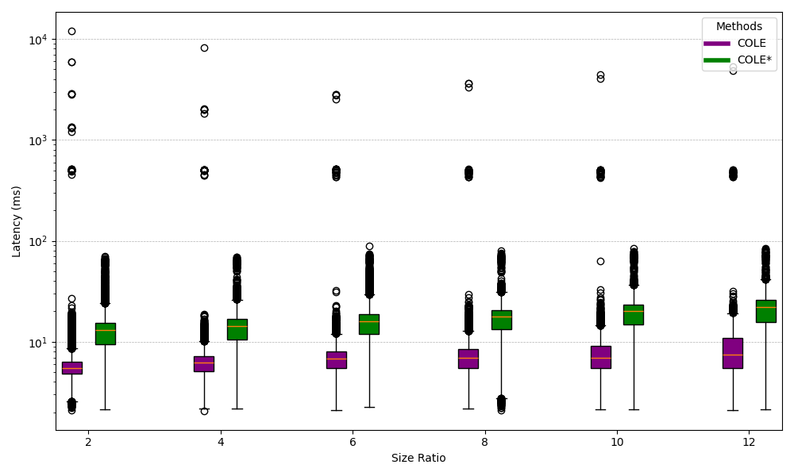

## Introduction
此repo 為COLE: A Column-based Learned Storage for Blockchain Systems的實驗結果 作者的原始碼:https://github.com/hkbudb/cole
實驗結果的資料量較大故我們將其單獨放在這個repo
- smallbank:為 smallbank的實驗結果
- readwriteeven:KVStore中readwriteeven的實驗結果
- readonly:KVStore中readonly的實驗結果
- writeonly:KVStore中writeonly的實驗結果
- graph_generate:根據結果的數據產生對應圖表
- memsize_eval:根據不同記憶體大小跑smallbank
## Hardware Configuration
- Running on Virtual Box 
- Intel i9-12900K
- 32GB RAM
- SSD 200 GB
- Ubuntu 20.04
## Baseline
- Cole(Column-based Learned Storage with asynchronous merge)):as paper
- MPT (Merkle Patricia Trie):Used by Ethereum to index blockchain storage
- LIPP (Learned Index with In-Place Data Writes):Applied learned index and without COLE's column-based design
- Column-based Merkle Index (CMI):Combines a column-based design with traditional Merkle indexing
- Cole*(Column-based Learned Storage with asynchronous merge):Cole with the asynchronous merge
## Evaluation index
本篇論文主要針對以下指標進行評估
1. Storage size
2. Througtput
3. Latency
4. Provenance query cpu time
5. Impact of Size Ratio

## Result 
圖片檔名的編號對應作者在論文中圖片的編號

