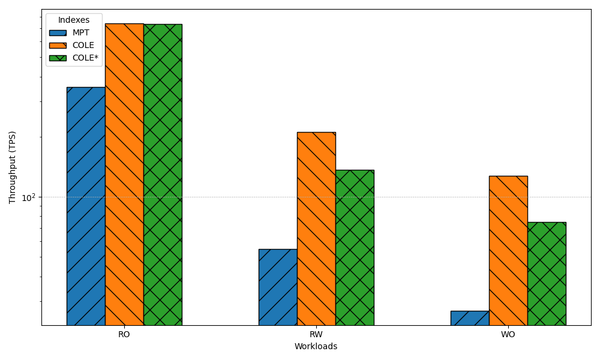
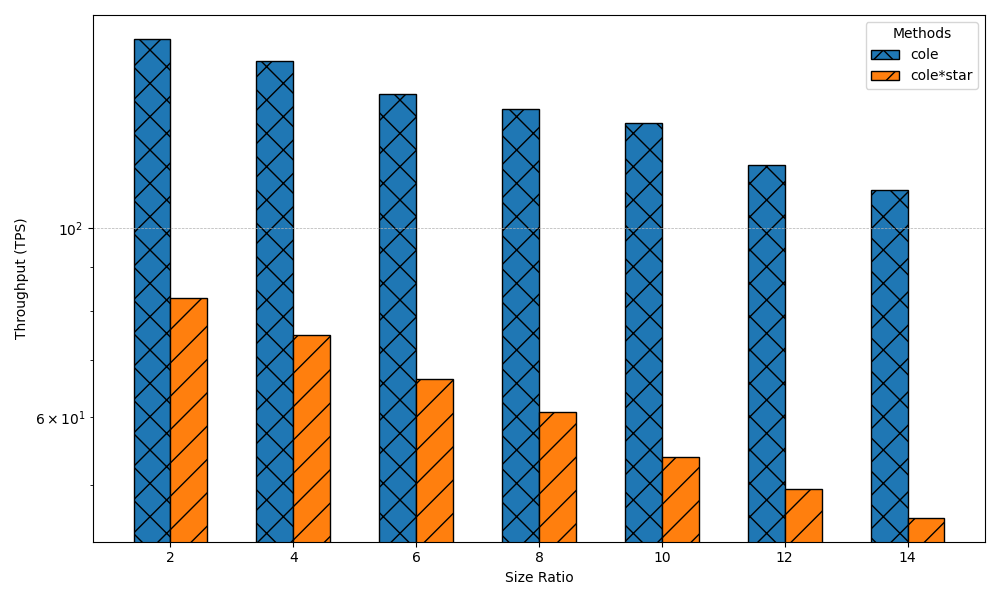

## Introduction
此repo 為COLE: A Column-based Learned Storage for Blockchain Systems的實驗結果 作者的原始碼:https://github.com/hkbudb/cole
實驗結果的資料量較大故我們將其單獨放在這個repo
- smallbank:為 smallbank的實驗結果
- readwriteeven:KVStore中readwriteeven的實驗結果
- readonly:KVStore中readonly的實驗結果
- writeonly:KVStore中writeonly的實驗結果
- graph_generate:根據結果的數據產生對應圖表
- memsize_eval:根據不同記憶體大小跑smallbank
## Hardware Configuration
- Running on Virtual Box 
- Intel i9-12900K
- 32GB RAM
- SSD 200 GB
- Ubuntu 20.04
## Baseline
- Cole(Column-based Learned Storage with asynchronous merge)):as paper
- MPT (Merkle Patricia Trie):Used by Ethereum to index blockchain storage
- LIPP (Learned Index with In-Place Data Writes):Applied learned index and without COLE's column-based design
- Column-based Merkle Index (CMI):Combines a column-based design with traditional Merkle indexing
- Cole*(Column-based Learned Storage with asynchronous merge):Cole with the asynchronous merge
## Evaluation index
本篇論文主要針對以下指標進行評估
1. Storage size
2. Througtput
3. Latency
4. Provenance query cpu time
5. Impact of Size Ratio

## Result 
- 圖片檔名的編號對應作者在論文中圖片的編號
- 實驗的結果大部分和作者的結果雷同,唯獨在圖13-a(size ratio對throughput 的影響)我們結果Throuhput會隨著size ratio越高而遞減
- 且COLE*的throughput並不像作者做出來的差距不大，反而很大。

圖9-a 為Storage Size和Block Height的關聯,在LIPP下由於隨著block height增加,benchmark所花的時間會呈現指數倍增,我們和作者一樣沒有針對block height在10^4和10^5 做測量。

圖9-b 為Throughput和Block Height的關聯,和9-a一樣原因,並沒有針對LIPP做實驗,但可推測throughtput會極小。

圖10-a 和9-a一樣但換成另一個KVstore。

圖10-b 和10-b一樣但換成另一個KVstore。

圖11-a 為在KVstore下，針對read intensive,write intensive和read write各半的workloads進行評估,且block height固定在10^4。

圖11-b 為在KVstore下，針對read intensive,write intensive和read write各半的workloads進行評估,且block height固定在10^5。

圖12-a 為在smallbank 中latency 的分布情況

圖12-b 為在kvstore 中latency 的分布情況

圖13-a 為在smallbank中不同size ratio 對throughput的影響，作者的數字在各個size ratio皆呈現穩定，但我們測出來throughput會隨著size ratio增加而遞減。

圖13-b 為在smallbank中不同size ratio latency的分布情況。

圖14-a 為在kvstore中query range不同對cpu time 的影響，這邊的cpu time 我們假設是query_avg_latency + verify_avg_latency

圖14-b 為在kvstore中query range不同對proof size的影響，這邊的cpu time 我們假設是query_avg_latency + verify_avg_latency

最後我們也設定了不同的RAM size跑smallbank，可以發現COLE的Elapsed time在不同大小皆呈現穩定的狀態。

